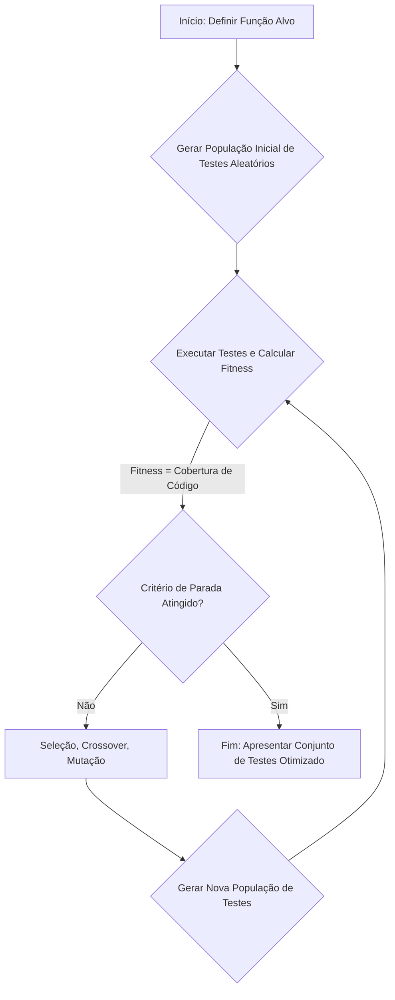

# Aula 6: Teste Baseado em Busca (SBST) - Automatizando a Caça aos Bugs

## Seção 1: Abertura e Engajamento

### 1.1. Problema Motivador

Imagine uma função em um sistema de controle de voo que calcula o ajuste do flap da asa de uma aeronave com base em três entradas: velocidade, altitude e ângulo de ataque. A lógica dentro dessa função é um emaranhado de `if/elif/else` que lida com dezenas de cenários: condições normais, emergências, decolagem, pouso, etc.

Como garantir que testamos todos os cenários críticos? Testar manualmente é inviável e propenso a erros. Escrever testes unitários para cada caminho lógico é tedioso e, pior, podemos esquecer uma combinação perigosa de entradas. Um bug em um desses caminhos "esquecidos" pode ter consequências catastróficas. E se, em vez de tentarmos adivinhar os dados de teste, pudéssemos "pedir" a um algoritmo para encontrá-los para nós? E se pudéssemos dizer: "Encontre para mim os valores de `(velocidade, altitude, angulo)` que ativam o modo de emergência de estol"? Isso é exatamente o que o Teste Baseado em Busca (SBST) nos permite fazer.

### 1.2. Objetivos deste Capítulo

Ao final deste capítulo, você será capaz de:

*   **Formular o Teste como Busca:** Traduzir o objetivo de "testar um software" em um problema de otimização com representação, função de fitness e operadores de busca.
*   **Aplicar Critérios de Cobertura:** Utilizar a cobertura de código (sentenças e ramos) como uma função de fitness para guiar a geração de dados de teste.
*   **Implementar um Gerador de Testes:** Construir um sistema em Python que usa um algoritmo genético para descobrir automaticamente os dados de entrada necessários para cobrir todos os caminhos lógicos de uma função complexa.

## Seção 2: Fundamentos Teóricos

SBST reformula o teste de software: em vez de ser uma atividade manual de verificação, torna-se um problema de busca automatizada. O objetivo é encontrar um conjunto de casos de teste que satisfaça um determinado critério (nosso objetivo de teste).

### O Tripé do SBST

1.  **Representação (O Indivíduo):** O que é um "caso de teste" para o nosso algoritmo? Geralmente, é um conjunto de dados de entrada para a função ou sistema sob teste.
    *   **Exemplo:** Para uma função `def calcula_imposto(salario: float, dependentes: int)`, um indivíduo (cromossomo) poderia ser uma lista ou tupla como `[5000.75, 3]`.

2.  **Função de Fitness (A Bússola):** Como medimos se um caso de teste é "bom"? A "bondade" está ligada ao nosso objetivo. No SBST, o objetivo mais comum é maximizar a **cobertura de código**.
    *   **Cobertura de Sentenças (Statement Coverage):** O quão perto um caso de teste chegou de executar uma linha de código ainda não coberta? A função de fitness recompensa indivíduos que executam novas linhas.
    *   **Cobertura de Ramos (Branch Coverage):** Mais poderosa. Para cada `if`, queremos um teste que o torne `True` e outro que o torne `False`. A função de fitness mede o quão perto uma entrada esteve de "virar" a condição de um ramo ainda não coberto.

3.  **Algoritmo de Busca:** Qualquer meta-heurística pode ser usada. Algoritmos Genéticos são muito populares porque a recombinação de diferentes dados de entrada (crossover) pode, intuitivamente, gerar novos casos de teste que exploram partes diferentes do código.

### Diagrama do Processo SBST



## Seção 3: Exemplo Ilustrativo

Vamos considerar uma função simples e ver como a "distância de ramo" (approach level) funciona como fitness.

````python
def classificar_idade(idade: int):
    if idade >= 18:
        print("Adulto")  # Ramo 1 (True)
    else:
        print("Menor")   # Ramo 2 (False)
````

Nosso objetivo é cobrir ambos os ramos.
*   **Indivíduo:** Um inteiro, `idade`.
*   **Fitness para o Ramo 1 (`idade >= 18`):**
    *   Se um indivíduo `idade = 25` atinge o ramo, sua fitness é 0 (perfeita).
    *   Se um indivíduo `idade = 10` **não** atinge o ramo, sua fitness não é apenas "ruim". Podemos calcular o quão "longe" ele estava. A distância pode ser `18 - idade`. Para `idade = 10`, a distância é 8. Para `idade = 17`, a distância é 1. O algoritmo usará essa informação para favorecer indivíduos mais próximos de 18.

Essa "distância" é a informação crucial que guia a busca de forma muito mais inteligente que uma busca aleatória.

## Seção 4: Análise e Tópicos Avançados

### O Problema do Oráculo de Teste

SBST é excelente para gerar entradas que cobrem o código, mas não resolve um problema fundamental: **como saber se a saída está correta?** Isso é conhecido como o **Problema do Oráculo de Teste**.

*   **SBST encontra o caminho:** Ele pode gerar os dados `(x, y, z)` que levam a uma falha.
*   **Mas não julga o resultado:** O algoritmo não sabe que o resultado ` -999` está errado. Ele apenas sabe que atingiu uma linha de código.

Na prática, o SBST é frequentemente usado para encontrar exceções não tratadas (`crash testing`) ou em combinação com "oráculos parciais", como invariantes de código (ex: `assert resultado >= 0`).

### Comparação: Cobertura de Sentenças vs. Ramos

| Critério | Vantagens | Desvantagens |
| :--- | :--- | :--- |
| **Cobertura de Sentenças** | Mais simples de calcular e entender. | Fraca. Pode deixar ramos lógicos importantes sem teste. |
| **Cobertura de Ramos** | Muito mais robusta. Força a exploração de diferentes caminhos lógicos. | Um pouco mais complexa de instrumentar e calcular a função de fitness. |

**Exemplo onde a cobertura de sentenças falha:**
```python
def processar_pedido(valor: float):
    if valor < 0:
        raise ValueError("Valor não pode ser negativo") # Bug aqui!
    # ... muito código ...
```
Um único teste com `valor = 100` pode atingir 100% de cobertura de sentenças, mas nunca descobrirá o bug no ramo `valor < 0`. A cobertura de ramos forçaria a busca a encontrar um valor negativo.

## Seção 5: Síntese e Próximos Passos

### 5.1. Resumo do Capítulo

*   O Teste Baseado em Busca (SBST) transforma a geração de testes em um problema de otimização, automatizando a descoberta de dados de teste eficazes.
*   A **representação** de um problema de SBST é geralmente o conjunto de dados de entrada da função que está sendo testada.
*   A **função de fitness** é tipicamente um critério de cobertura de código, como cobertura de sentenças ou, de forma mais poderosa, cobertura de ramos.
*   A "distância de aproximação" (approach level) é uma métrica de fitness chave que informa o quão perto um caso de teste não bem-sucedido esteve de atingir seu alvo.
*   SBST é poderoso para forçar a execução de caminhos de código, mas não resolve o "Problema do Oráculo de Teste" (verificar se a saída está correta).

### 5.2. Ponte e Briefing para o Workshop Prático (`.ipynb`)

**Teaser para o Aluno:** A teoria é fascinante, mas agora é hora de construir nosso próprio "caçador de bugs" automatizado. No próximo workshop, você implementará um sistema SBST completo usando Python e DEAP. Você pegará uma função com lógica condicional complexa e observará, em tempo real, como o algoritmo genético evolui uma população de dados de teste aleatórios até encontrar o conjunto exato necessário para explorar cada canto do seu código.

**Briefing para o Agente de Prática (Geração do `workshop.ipynb`):**

O notebook deve implementar um sistema de **geração de testes baseado em busca para maximizar a cobertura de ramos**.

1.  **Função-Alvo:** Crie uma função Python chamada `classificador_complexo(x: int, y: int, z: str) -> str`. Esta função deve ter de 5 a 7 ramos lógicos (uma combinação de `if/elif/else` aninhados) que sejam difíceis de cobrir com testes aleatórios. Inclua um ramo que só é ativado por uma combinação muito específica (ex: `x > 100 and y < 0 and z == "ativar"`).

2.  **Instrumentação e Cobertura:**
    *   Crie uma classe ou um decorator para "instrumentar" a função-alvo. Antes da execução, ele deve limpar um registro de cobertura. Durante a execução, ele deve registrar quais ramos (identificados por um ID único) foram executados.
    *   Implemente uma função `get_coverage(test_case)` que executa a função-alvo com um caso de teste e retorna o conjunto de IDs de ramos cobertos.

3.  **Estrutura com DEAP:**
    *   Use o `creator` para definir `FitnessMax` e um `Individual` (que será uma lista representando `[x, y, z]`).
    *   Defina a `toolbox` com os seguintes operadores:
        *   **Geração de Indivíduos:** `attr_int` para `x` e `y`, e um gerador customizado para `z` que escolhe de uma lista de strings.
        *   **Função de Fitness (`evaluate`):** Esta é a parte central. A fitness de um indivíduo (caso de teste) será o **número de ramos que ele cobre**.
        *   Operadores padrão: `cxTwoPoint`, `mutGaussian` (para os inteiros) e um `mutShuffleIndexes` ou similar para a string, e `selTournament`.

4.  **Execução e Análise:**
    *   Execute o algoritmo `eaSimple` por um número de gerações.
    *   Ao final, extraia os melhores indivíduos de cada geração.
    *   Mostre o conjunto final de casos de teste gerado e demonstre que, juntos, eles atingem 100% de cobertura de ramos, imprimindo quais casos de teste cobriram quais ramos.
    *   **Visualização:** Crie um gráfico simples mostrando a "Cobertura Máxima" e a "Cobertura Média" da população ao longo das gerações. Isso mostrará visualmente a eficácia da busca.
