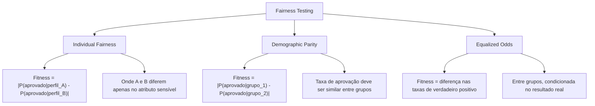

# Aula 10: Laboratório de Fairness Testing - Implementando Detectores de Viés com SBSE

## Seção 1: Abertura e Engajamento

### 1.1. Problema Motivador

Na aula anterior, discutimos os fundamentos teóricos do fairness testing e como algoritmos de busca podem ser usados para detectar viés em modelos de IA. Agora, é hora de colocar essa teoria em prática. Imagine que você foi contratado como consultor de ética em IA por um banco que suspeita que seu sistema de aprovação de crédito pode estar discriminando contra certas populações.

O modelo está em produção há dois anos e aprovou milhões de empréstimos. Como você pode, de forma systematic e objetiva, provar se existe discriminação? Testes manuais são impossíveis – há infinitas combinações de perfis de clientes para testar. Análises estatísticas tradicionais podem perder casos sutis de discriminação que só emergem em combinações específicas de atributos.

É aqui que o poder do SBSE brilha: vamos construir um "detetive automatizado de viés" que usar inteligência artificial para encontrar inteligência artificial enviesada. Nosso algoritmo genético será como um investigador incansável, gerando milhares de perfis sintéticos de clientes, testando-os no modelo, e descobrindo automaticamente os casos onde a discriminação é mais evidente.

### 1.2. Objetivos deste Laboratório

Ao final deste laboratório, você será capaz de:

*   **Construir um Sistema de Fairness Testing:** Implementar um framework completo que combina DEAP, scikit-learn e técnicas de fairness para detectar viés automaticamente.
*   **Aplicar Múltiplas Métricas de Fairness:** Usar diferentes definições de justiça (Individual Fairness, Demographic Parity, Equalized Odds) como funções de fitness e comparar seus resultados.
*   **Interpretar Resultados de Bias Testing:** Analisar os perfis discriminatórios encontrados pelo algoritmo, identificar padrões, e propor estratégias de mitigação baseadas em evidências.

## Seção 2: Fundamentos Teóricos (Versão Expressa)

Neste laboratório, aplicaremos os conceitos teóricos da Aula 9 em um sistema prático. Vamos recapitular rapidamente os três pilares do fairness testing com SBSE:

### O Tripé Prático do Fairness Testing

1.  **Representação (O Perfil do Cliente):** 
    *   **O que é?** Um indivíduo no nosso AG representa um perfil completo de cliente com todos os atributos que o modelo usa para tomar decisões.
    *   **Implementação:** Uma lista de valores mistos: `[idade: int, salario: float, genero: str, etnia: str, score_credito: int, ...]`

2.  **Função de Fitness (O Detector de Discriminação):**
    *   **O que é?** Uma função que mede o grau de discriminação revelado por um perfil ou par de perfis.
    *   **Tipos Implementados:**
        *   **Individual Fairness:** Compara perfis quase idênticos que diferem apenas no atributo sensível.
        *   **Group Fairness:** Mede disparidade nas taxas de aprovação entre grupos demográficos.
        *   **Causal Fairness:** Avalia o impacto direto de mudanças em atributos sensíveis.

3.  **Algoritmo de Busca (O Investigador Automatizado):**
    *   **O que é?** Um AG que evolui perfis para maximizar a detecção de viés, explorando sistematicamente o espaço de possíveis clientes.
    *   **Insight Crucial:** Não procuramos pela resposta "correta", mas pelos casos mais "suspeitos" de discriminação.

### Métricas de Fairness Implementadas

## Seção 3: Laboratório Prático Guiado (Google Colab)

### 3.1. Roteiro do Notebook: `workshop.ipynb`

Neste laboratório, trabalharemos com um cenário realista: um modelo de aprovação de crédito treinado com dados históricos de um banco. O modelo foi intencionalmente treinado com dados enviesados para simular problemas reais que encontramos na indústria. Nossa tarefa é usar SBSE para descobrir e quantificar esses vieses de forma automatizada.

### 3.2. Estrutura do Laboratório

O notebook será dividido em cinco partes principais:

*   **Parte 1: Configuração e Análise do Modelo Enviesado:**
    *   Carregamento de um modelo pré-treinado que simula viés de gênero e etnia.
    *   Análise exploratória inicial: verificar se o viés é evidente em análises estatísticas simples.
    *   Demonstração de que alguns tipos de discriminação são difíceis de detectar sem ferramentas sofisticadas.

*   **Parte 2: Implementação da Representação e Operadores SBSE:**
    *   Definição da estrutura do `Individual` usando DEAP para representar perfis de clientes.
    *   Implementação de operadores especializados para dados mistos (numéricos + categóricos).
    *   Criação de geradores de perfis válidos que respeitam restrições do domínio.

*   **Parte 3: Múltiplas Funções de Fitness para Fairness:**
    *   **Individual Fairness Fitness:** Implementação da função que compara pares de perfis similares.
    *   **Demographic Parity Fitness:** Função que mede disparidade entre grupos demográficos.
    *   **Equalized Odds Fitness:** Implementação de métricas condicionais de fairness.
    *   Comparação teórica e prática entre as diferentes abordagens.

*   **Parte 4: Execução dos Experimentos de Fairness Testing:**
    *   Configuração e execução de três algoritmos genéticos paralelos, cada um otimizando uma métrica diferente.
    *   Visualização da evolução da população e convergência das métricas de fitness.
    *   Coleta dos perfis mais discriminatórios encontrados por cada abordagem.

*   **Parte 5: Análise de Resultados e Propostas de Mitigação:**
    *   Análise detalhada dos perfis discriminatórios descobertos pelo AG.
    *   Identificação de padrões: quais combinações de atributos levam à maior discriminação?
    *   Cálculo de métricas de fairness padrão nos casos encontrados.
    *   Discussão de estratégias de mitigação baseadas nos achados.

## Seção 4: Análise e Discussão dos Resultados

### 4.1. Interpretando os Resultados

Ao final do laboratório, teremos três conjuntos de perfis discriminatórios, cada um descoberto por uma métrica de fairness diferente. As perguntas-chave são:

*   **Consistência entre Métricas:** Os diferentes tipos de fairness identificaram os mesmos casos problemáticos, ou cada métrica revelou aspectos diferentes do viés?
*   **Magnitude da Discriminação:** Qual é a diferença máxima de probabilidade de aprovação encontrada? Essa diferença é estatística e praticamente significativa?
*   **Padrões de Discriminação:** Existem perfis específicos (ex: mulheres jovens com alta renda) que são sistematicamente discriminados? Ou o viés é mais sutil e contextual?

### 4.2. O "Porquê" das Decisões Técnicas

*   **Por que Múltiplas Métricas de Fairness?** Não existe uma definição universal de "justiça". Cada métrica captura um aspecto diferente da discriminação. Individual Fairness foca em tratamento similar de casos similares, enquanto Demographic Parity se preocupa com representação proporcional de grupos.
*   **Por que Usar AG ao Invés de Análise Estatística?** Análises tradicionais assumem independência entre atributos e linearidade nas relações. AG explora combinações não-lineares e interações complexas entre atributos que podem revelar discriminação sutil.
*   **Por que Perfis Sintéticos?** Gerar perfis sintéticos nos permite explorar sistematicamente o espaço de possibilidades sem limitações de privacidade ou disponibilidade de dados reais específicos.

### 4.3. Limitações e Considerações Éticas

*   **Fairness ≠ Accuracy Trade-off:** Os casos de maior discriminação encontrados podem corresponder a situações onde o modelo tem alta confiança estatística. Discutir quando a precisão estatística pode justificar diferenças de tratamento.
*   **Viés nos Dados vs. Viés no Modelo:** SBSE detecta discriminação no comportamento do modelo, mas não distingue se ela vem de viés nos dados de treinamento ou na arquitetura do modelo.
*   **Contexto Social e Legal:** Diferentes jurisdições têm diferentes definições legais de discriminação. O que é tecnicamente "justo" pode não ser legalmente aceitável, e vice-versa.

## Seção 5: Síntese e Próximos Passos

### 5.1. Resumo do Laboratório

*   **SBSE como Ferramenta de Auditoria:** Algoritmos genéticos provaram ser eficazes para descobrir casos de discriminação que análises manuais ou estatísticas tradicionais poderiam perder.
*   **Múltiplas Dimensões de Fairness:** Diferentes métricas de fairness revelam aspectos diferentes da discriminação, sendo necessário usar várias perspectivas para uma análise completa.
*   **Automatização da Detecção de Viés:** O framework desenvolvido pode ser adaptado para outros modelos e domínios, fornecendo uma ferramenta prática para auditoria de IA.
*   **Base para Mitigação:** Os perfis discriminatórios encontrados fornecem evidências concretas para estratégias de mitigação direcionadas.

### 5.2. Ponte e Briefing para o Workshop Prático (`.ipynb`)

**Teaser para o Aluno:** Você acabou de implementar um sistema de auditoria de IA de nível profissional! O framework que criamos pode ser aplicado a qualquer modelo de classificação, desde sistemas de recrutamento até algoritmos de justiça criminal. Na próxima aula, expandiremos nosso arsenal de SBSE para IA, explorando como otimizar hiperparâmetros e até mesmo prompts de LLMs usando técnicas de busca.

**Briefing para o Agente de Prática (Geração do `workshop.ipynb`):**

O notebook deve implementar um **sistema completo de fairness testing** com as seguintes especificações técnicas detalhadas:

1.  **Modelo-Alvo e Dataset:**
    *   Crie um modelo de classificação discriminatório usando scikit-learn (RandomForestClassifier ou LogisticRegression).
    *   Use o dataset de crédito alemão (German Credit) ou crie um dataset sintético com viés explícito.
    *   O modelo deve mostrar discriminação clara contra pelo menos um grupo (ex: gênero=feminino, idade>50).

2.  **Representação SBSE Avançada:**
    *   Implemente uma classe `CustomerProfile` que herda de `list` mas adiciona métodos de validação.
    *   Cada perfil deve ter 6-8 atributos: `[idade, salario, score_credito, anos_historico, genero, etnia, educacao, estado_civil]`.
    *   Implemente geradores de atributos que respeitam distribuições realistas e restrições do domínio.

3.  **Múltiplas Funções de Fitness:**
    *   **`individual_fairness_fitness`:** Compara pares de perfis que diferem apenas no atributo sensível especificado.
    *   **`demographic_parity_fitness`:** Mede a diferença na taxa de aprovação entre dois grupos demográficos.
    *   **`equalized_odds_fitness`:** Calcula diferenças nas taxas de verdadeiro positivo entre grupos (requer labels de validação).

4.  **Configuração DEAP Especializada:**
    *   Use `creator` para definir três tipos de fitness diferentes (uma para cada métrica).
    *   Implemente operadores de crossover e mutação que preservam a validade dos perfis.
    *   Configure três `toolbox` separadas, uma para cada tipo de fairness testing.

5.  **Experimentação Paralela:**
    *   Execute três algoritmos genéticos em paralelo, cada um otimizando uma métrica diferente.
    *   Use `multiprocessing` ou execute sequencialmente com seed diferente para cada um.
    *   Colete estatísticas de convergência e diversidade da população para cada experimento.

6.  **Análise de Resultados Profissional:**
    *   Crie visualizações comparativas dos perfis discriminatórios encontrados por cada métrica.
    *   Implemente uma função de `bias_analysis` que calcula métricas padrão (Disparate Impact, Statistical Parity).
    *   Gere um "relatório de auditoria" automatizado listando os casos mais preocupantes encontrados.
    *   Inclua uma seção de recomendações de mitigação baseadas nos padrões identificados.

7.  **Validação e Comparação:**
    *   Compare os resultados do SBSE com análises estatísticas tradicionais (chi-quadrado, t-test).
    *   Demonstre casos onde o AG encontrou discriminação que análises simples perderam.
    *   Calcule métricas de eficiência: quantas avaliações foram necessárias para encontrar os casos mais discriminatórios?

8.  **Extensões Avançadas (Opcional):**
    *   Implemente "fairness through unawareness" removendo atributos sensíveis e testando se proxies mantêm discriminação.
    *   Teste com diferentes arquiteturas de modelo (SVM, Neural Network) para avaliar generalização.
    *   Explore "intersectional bias" otimizando para discriminação baseada em múltiplos atributos simultaneamente.