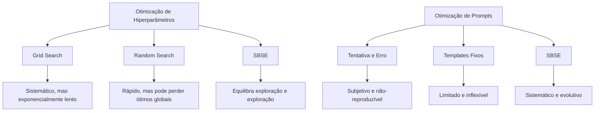

# Aula 11: Otimização de Hiperparâmetros e Prompts - SBSE na Era dos LLMs

## Seção 1: Abertura e Engajamento

### 1.1. Problema Motivador

Imagine dois cenários aparentemente diferentes, mas que compartilham um desafio fundamental:

**Cenário 1:** Você está treinando uma rede neural para classificação de imagens médicas e precisa encontrar a combinação perfeita de learning rate (0.001? 0.01?), batch size (32? 128?), número de camadas ocultas (3? 10?), dropout rate (0.2? 0.5?), e otimizador (Adam? SGD?). Com 5 hiperparâmetros e múltiplas opções para cada um, você tem milhares de combinações possíveis. Grid Search testaria todas sistematicamente, mas levaria semanas. Random Search é mais rápido, mas pode perder a combinação ótima.

**Cenário 2:** Você está desenvolvendo um chatbot para atendimento ao cliente e precisa criar o prompt perfeito para o GPT-4. O prompt deve ser educado, mas assertivo; técnico, mas acessível; empático, mas eficiente. Pequenas mudanças como "Por favor, ajude o cliente" vs. "Assistir o usuário com cortesia" podem dramaticamente alterar a qualidade das respostas. Como encontrar a formulação ideal entre infinitas possibilidades linguísticas?

Ambos os problemas envolvem espaços de busca complexos, funções de qualidade não-triviais, e a necessidade de balancear exploração vs. exploração. É aqui que SBSE brilha: transformando tanto a otimização de hiperparâmetros quanto a engenharia de prompts em problemas evolutivos, onde algoritmos genéticos podem descobrir soluções que métodos tradicionais jamais encontrariam.

### 1.2. Objetivos deste Capítulo

Ao final deste capítulo, você será capaz de:

*   **Revolucionar a Otimização de Hiperparâmetros:** Formular o tunning de modelos ML como um problema de busca, superando as limitações de Grid Search e Random Search através de algoritmos evolutivos.
*   **Automatizar a Engenharia de Prompts:** Modelar a criação de prompts como um problema de otimização textual, usando operadores genéticos especializados para linguagem natural.
*   **Implementar Sistemas de Otimização Híbridos:** Construir frameworks que combinam DEAP com bibliotecas de ML e APIs de LLMs para criar soluções de otimização de próxima geração.

## Seção 2: Fundamentos Teóricos (Versão Expressa)

A aplicação de SBSE para otimização de hiperparâmetros e prompts representa a convergência de três domínios: otimização evolutiva, machine learning, e processamento de linguagem natural. Ambos os problemas compartilham características que os tornam ideais para abordagens evolutivas.

### O Tripé da Otimização Evolutiva para IA

1.  **Representação Híbrida:**
    *   **Hiperparâmetros:** Vetores de valores numéricos e categóricos (ex: `[lr=0.01, batch=64, optimizer='adam', layers=5]`).
    *   **Prompts:** Sequências de tokens ou palavras que podem ser manipuladas através de operadores linguísticos.

2.  **Função de Fitness Adaptativa:**
    *   **Para ML:** Métricas de performance (acurácia, F1-score, AUC) no conjunto de validação.
    *   **Para Prompts:** Qualidade da resposta medida por outro LLM, métricas de fluência, ou scores específicos da tarefa.

3.  **Algoritmos de Busca Especializados:**
    *   **Para espaços contínuos:** Evolution Strategies (ES), Differential Evolution (DE).
    *   **Para espaços mistos:** Algoritmos Genéticos com operadores híbridos.
    *   **Para sequências:** Algoritmos genéticos com crossover e mutação linguística.

### Comparação: Métodos Tradicionais vs. SBSE



## Seção 3: Exemplo Ilustrativo

Vamos considerar um exemplo concreto para cada domínio:

### Otimização de Hiperparâmetros com AG

**Problema:** Otimizar uma Random Forest para classificação de spam.

**Representação:**
```python
# Individual = [n_estimators, max_depth, min_samples_split, criterion]
# Exemplo: [100, 10, 2, 'gini']
```

**Função de Fitness:**
```python
def evaluate_hyperparams(individual):
    n_est, max_d, min_split, crit = individual
    
    model = RandomForestClassifier(
        n_estimators=n_est,
        max_depth=max_d,
        min_samples_split=min_split,
        criterion=crit
    )
    
    # Cross-validation score
    scores = cross_val_score(model, X_train, y_train, cv=5)
    return scores.mean()  # Fitness = acurácia média
```

### Otimização de Prompts com AG

**Problema:** Criar o melhor prompt para resumir artigos científicos.

**Representação:**
```python
# Prompt como lista de componentes modulares
prompt_components = [
    "instruction": ["Summarize", "Create a summary", "Extract key points"],
    "style": ["concisely", "clearly", "in simple terms"],
    "constraint": ["in 100 words", "in 3 sentences", "highlighting main findings"]
]
```

**Função de Fitness:**
```python
def evaluate_prompt(individual):
    # Construir prompt a partir dos componentes
    prompt = f"{individual[0]} the following text {individual[1]} {individual[2]}"
    
    # Testar com LLM
    response = llm_api.generate(prompt + text_sample)
    
    # Avaliar qualidade (via outro LLM ou métricas)
    quality_score = evaluate_summary_quality(response, reference_summary)
    return quality_score
```

## Seção 4: Análise e Tópicos Avançados

### Desafios Únicos da Otimização para IA

#### Ruído e Variabilidade
Diferente de funções matemáticas determinísticas, a avaliação de hiperparâmetros e prompts envolve:
*   **Variabilidade Estocástica:** O mesmo conjunto de hiperparâmetros pode produzir resultados ligeiramente diferentes devido à inicialização aleatória.
*   **Ruído de API:** LLMs podem retornar respostas diferentes para o mesmo prompt devido à amostragem.
*   **Dependência de Dados:** A qualidade varia conforme o conjunto de dados de teste.

#### Custo Computacional
*   **Hiperparâmetros:** Treinar um modelo pode levar horas. Populações grandes são inviáveis.
*   **Prompts:** Cada avaliação consome tokens de API, gerando custos reais.
*   **Solução:** Técnicas de early stopping, surrogate models, e avaliação incremental.

### Técnicas Avançadas

#### Multi-Objective Optimization
Em muitos casos, otimizamos múltiplos objetivos simultaneamente:
*   **Para ML:** Maximizar acurácia enquanto minimizamos tempo de treinamento.
*   **Para Prompts:** Maximizar qualidade enquanto minimizamos número de tokens (custo).

#### Transfer Learning para Otimização
*   **Conhecimento de Domínio:** Usar hiperparâmetros otimizados em problemas similares como ponto de partida.
*   **Prompt Templates:** Evoluir variações de prompts que funcionaram bem em tarefas relacionadas.

#### Otimização Contextual
*   **Adaptive Prompting:** Ajustar prompts baseado no histórico da conversa.
*   **Dynamic Hyperparameters:** Modificar hiperparâmetros durante o treinamento baseado na performance.

### Limitações e Armadilhas

#### Overfitting de Hiperparâmetros
Otimizar excessivamente no conjunto de validação pode levar a hiperparâmetros que não generalizam. É crucial manter um conjunto de teste verdadeiramente independente.

#### Prompt Brittleness
Prompts otimizados podem ser extremamente sensíveis a pequenas mudanças ou podem não funcionar bem com versões diferentes do modelo.

#### Custo vs. Benefício
Para problemas simples, o overhead de configurar SBSE pode não compensar. Grid Search limitado ou Random Search podem ser suficientes.

## Seção 5: Síntese e Próximos Passos

### 5.1. Resumo do Capítulo

*   **SBSE como Meta-Otimizador:** Algoritmos evolutivos podem otimizar tanto hiperparâmetros de modelos ML quanto prompts de LLMs, superando métodos tradicionais em espaços de busca complexos.
*   **Representações Híbridas:** A capacidade de SBSE de lidar com variáveis numéricas, categóricas e sequenciais torna-a ideal para otimização em IA.
*   **Funções de Fitness Adaptáveis:** A flexibilidade na definição de fitness permite otimizar múltiplas métricas e incorporar restrições específicas do domínio.
*   **Custo-Benefício Consciente:** A implementação eficiente requer considerar trade-offs entre qualidade da solução e recursos computacionais.
*   **Futuro da Otimização:** SBSE representa o estado da arte para otimização em sistemas de IA, especialmente quando métodos tradicionais falham.

### 5.2. Ponte e Briefing para o Workshop Prático (`.ipynb`)

**Teaser para o Aluno:** Chegou a hora de construir seus próprios otimizadores evolutivos para IA! No laboratório prático, você implementará dois sistemas revolucionários: um otimizador de hiperparâmetros que supera Grid Search e Random Search, e um gerador automático de prompts que encontra formulações que você nunca imaginaria. Você verá como poucos ajustes evolutivos podem levar sua IA de boa para excepcional.

**Briefing para o Agente de Prática (Geração do `workshop.ipynb`):**

O notebook deve implementar **dois sistemas completos de otimização**: um para hiperparâmetros de ML e outro para prompts de LLMs.

**Parte 1: Otimização de Hiperparâmetros**

1.  **Problema-Alvo e Dataset:**
    *   Use o dataset Iris ou Wine para classificação (scikit-learn).
    *   Modelo-alvo: RandomForestClassifier com 4-5 hiperparâmetros para otimizar.
    *   Hiperparâmetros: `n_estimators` (int, 10-200), `max_depth` (int, 1-20), `min_samples_split` (int, 2-10), `criterion` (categórico: 'gini', 'entropy').

2.  **Representação SBSE:**
    *   Use DEAP para criar um `Individual` misto (inteiros + categóricos).
    *   Implemente geradores adequados para cada tipo de hiperparâmetro.
    *   Configure constraints para garantir valores válidos.

3.  **Função de Fitness:**
    *   Implemente avaliação baseada em cross-validation (5-fold).
    *   A fitness deve ser a acurácia média, com penalização para modelos muito complexos (opcional).
    *   Adicione cache para evitar re-avaliações desnecessárias.

4.  **Comparação de Métodos:**
    *   Implemente Grid Search e Random Search baseline.
    *   Execute todos os três métodos com o mesmo budget computacional.
    *   Compare resultados finais e curvas de convergência.

**Parte 2: Otimização de Prompts**

1.  **Configuração de LLM:**
    *   Use a API da OpenAI (ou alternativa gratuita como Ollama local).
    *   Tarefa-alvo: Geração de resumos de textos ou classificação de sentimentos.
    *   Prepare 3-5 textos de exemplo para teste.

2.  **Representação de Prompts:**
    *   Modele prompts como sequências de componentes modulares.
    *   Componentes: `[instruction, style, format, constraint]`.
    *   Cada componente tem 3-5 opções predefinidas.
    *   Exemplo: `["Summarize", "concisely", "in bullet points", "max 50 words"]`.

3.  **Função de Fitness:**
    *   Implemente avaliação automática da qualidade da resposta.
    *   Use métricas como BLEU score (para resumos) ou sentiment accuracy.
    *   Alternativamente, use outro LLM como "juiz" da qualidade.
    *   Considere custo (número de tokens) como fator de fitness.

4.  **Operadores Especializados:**
    *   Crossover: Combinar componentes de dois prompts pais.
    *   Mutação: Trocar um componente por uma alternativa aleatória.
    *   Implemente repair para garantir prompts válidos.

**Parte 3: Análise Comparativa**

1.  **Visualizações:**
    *   Gráfico de convergência para ambos os problemas.
    *   Heatmap de correlação entre hiperparâmetros e performance.
    *   Word cloud dos componentes de prompt mais eficazes.

2.  **Análise Estatística:**
    *   Teste de significância entre métodos de otimização.
    *   Análise de robustez: como soluções variam entre execuções?
    *   Cálculo de custo-benefício: tempo vs. qualidade obtida.

3.  **Insights e Conclusões:**
    *   Que padrões emergem dos melhores hiperparâmetros encontrados?
    *   Quais componentes de prompt são consistentemente eficazes?
    *   Quando SBSE vale o investimento vs. métodos mais simples?

**Requisitos Técnicos:**

*   Use DEAP para ambos os problemas.
*   Implemente logging detalhado do progresso evolutivo.
*   Adicione tratamento de erros para APIs externas.
*   Código modular e reutilizável entre os dois sistemas.
*   Documentação clara explicando cada decisão de design.