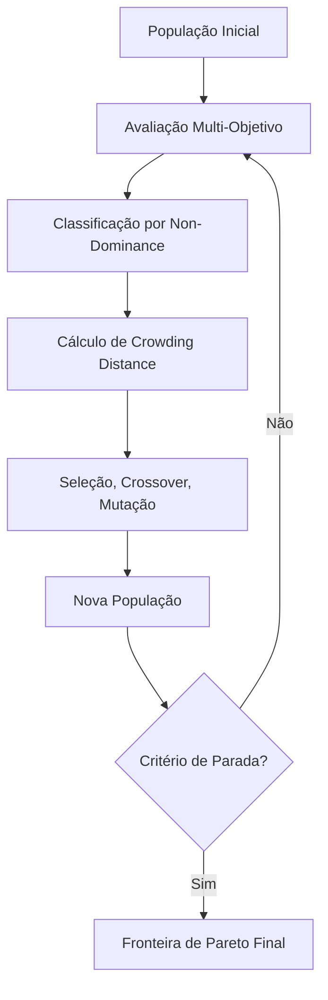

# Aula 13: Laboratório de Otimização Multi-Objetivo com Pymoo - Navegando Trade-offs com a Fronteira de Pareto

## Seção 1: Abertura e Engajamento

### 1.1. Problema Motivador

Imagine que você é o gerente de produto de uma startup de tecnologia financeira que precisa decidir quais funcionalidades implementar na próxima versão do seu aplicativo. Você tem uma lista de 20 features candidatas: algumas aumentam significativamente a satisfação do usuário, outras reduzem custos operacionais, algumas melhoram a segurança, e outras aceleram o time-to-market. O dilema é real: você tem recursos limitados (budget de R$ 500.000 e 3 meses de desenvolvimento) e precisa maximizar simultaneamente a satisfação do cliente, minimizar custos, maximizar receita potencial e minimizar riscos de segurança.

Este é um problema clássico de **otimização multi-objetivo**. Diferente dos problemas que vimos até agora, onde buscávamos maximizar uma única função de fitness, aqui temos múltiplos objetivos que frequentemente são **conflitantes**. Melhorar a segurança pode aumentar custos. Acelerar o desenvolvimento pode comprometer a qualidade. Adicionar features populares pode impactar a performance.

Até agora, nossa abordagem para múltiplos objetivos tem sido criar uma função de fitness ponderada: `fitness = w1*objetivo1 + w2*objetivo2 + w3*objetivo3`. Mas quem define os pesos? Como saber se `w1=0.6, w2=0.3, w3=0.1` é melhor que `w1=0.4, w2=0.4, w3=0.2`? E se não existe uma única "melhor" solução, mas sim um conjunto de soluções igualmente válidas, cada uma representando um trade-off diferente?

Bem-vindos ao mundo da **Otimização Multi-Objetivo** e da **Fronteira de Pareto** – onde não buscamos **a** solução ótima, mas sim **o conjunto** de soluções ótimas que representa todos os trade-offs possíveis entre objetivos conflitantes.

### 1.2. Objetivos deste Laboratório

Ao final deste laboratório, você será capaz de:

*   **Dominar a Teoria Multi-Objetivo:** Compreender os conceitos de Dominância de Pareto, Fronteira de Pareto, e quando a otimização multi-objetivo é superior à abordagem de função ponderada.
*   **Implementar NSGA-II com Pymoo:** Utilizar a biblioteca Pymoo para resolver problemas reais de otimização multi-objetivo, configurando o algoritmo NSGA-II e interpretando seus resultados.
*   **Resolver o Next Release Problem:** Aplicar otimização multi-objetivo a um problema clássico da engenharia de software, balanceando satisfação do cliente, custo de desenvolvimento, e riscos do projeto.

## Seção 2: Fundamentos Teóricos (Versão Expressa)

A otimização multi-objetivo representa uma mudança fundamental de paradigma: em vez de procurar **a** melhor solução, procuramos **o conjunto** das melhores soluções. Cada solução neste conjunto representa um trade-off diferente entre os objetivos conflitantes.

### O Tripé da Otimização Multi-Objetivo

1.  **Múltiplos Objetivos Conflitantes:**
    *   **O que são?** Funções que queremos otimizar simultaneamente, mas que frequentemente puxam a solução em direções opostas.
    *   **Exemplo:** Em um sistema de e-commerce, queremos maximizar velocidade de resposta e maximizar personalização, mas personalização geralmente requer mais processamento, reduzindo a velocidade.

2.  **Dominância de Pareto:**
    *   **O que é?** Uma relação que nos permite comparar soluções multi-objetivo. A solução A domina a solução B se A é pelo menos tão boa quanto B em todos os objetivos, e estritamente melhor em pelo menos um objetivo.
    *   **Insight:** Se uma solução não é dominada por nenhuma outra, ela é **Pareto-ótima**.

3.  **Fronteira de Pareto:**
    *   **O que é?** O conjunto de todas as soluções Pareto-ótimas. Representa os melhores trade-offs possíveis entre os objetivos.
    *   **Valor Prático:** Em vez de retornar uma única solução, retornamos uma "galeria" de soluções ótimas para que o tomador de decisão escolha baseado em suas preferências.

### Algoritmo NSGA-II (Non-dominated Sorting Genetic Algorithm II)

O NSGA-II é o algoritmo multi-objetivo mais utilizado na prática. Sua estratégia principal é:

1.  **Classificação por Não-dominância:** Agrupa indivíduos em "fronts" baseado em dominância.
2.  **Diversidade através de Crowding Distance:** Prefere soluções que estão em regiões menos populosas da fronteira.
3.  **Seleção Elitista:** Mantém as melhores soluções de geração para geração.



### Comparação: Mono-Objetivo vs. Multi-Objetivo

| Aspecto | Mono-Objetivo | Multi-Objetivo |
|---------|---------------|----------------|
| **Resultado** | Uma única solução "ótima" | Conjunto de soluções Pareto-ótimas |
| **Função de Fitness** | Escalar (um número) | Vetor (múltiplos números) |
| **Seleção** | Baseada em fitness único | Baseada em dominância e diversidade |
| **Interpretação** | Simples: maior fitness = melhor | Complexa: trade-offs entre objetivos |
| **Tomada de Decisão** | Automática | Requer escolha humana final |

## Seção 3: Exemplo Ilustrativo

Vamos considerar uma versão simplificada do Next Release Problem para demonstrar os conceitos.

### Problema: Seleção de Features para uma App de Fitness

**Cenário:** Temos 8 features candidatas para a próxima versão de um app de fitness. Cada feature tem um custo de desenvolvimento e um impacto na satisfação do usuário.

**Objectives:**
1. **Maximizar Satisfação do Usuário** (soma dos impactos das features selecionadas)
2. **Minimizar Custo de Desenvolvimento** (soma dos custos das features selecionadas)

**Features Candidatas:**
```python
features = [
    {"nome": "Tracking GPS Avançado", "satisfacao": 85, "custo": 12000},
    {"nome": "Integração com Wearables", "satisfacao": 70, "custo": 8000},
    {"nome": "Planos de Treino IA", "satisfacao": 90, "custo": 15000},
    {"nome": "Social Feed", "satisfacao": 60, "custo": 5000},
    {"nome": "Nutrição Personalizada", "satisfacao": 80, "custo": 10000},
    {"nome": "Gamificação", "satisfacao": 65, "custo": 6000},
    {"nome": "Análise de Sono", "satisfacao": 75, "custo": 9000},
    {"nome": "Coaching Virtual", "satisfacao": 95, "custo": 18000}
]
```

**Representação:** Vetor binário de 8 bits, onde `[1,0,1,1,0,0,1,0]` significa selecionar features 1, 3, 4, e 7.

**Função de Fitness Multi-Objetivo:**
```python
def avaliar_multi_objetivo(individual):
    satisfacao_total = sum(features[i]["satisfacao"] for i, selected in enumerate(individual) if selected)
    custo_total = sum(features[i]["custo"] for i, selected in enumerate(individual) if selected)
    
    # Retorna tuple: (objetivo1_para_maximizar, objetivo2_para_minimizar)
    return (satisfacao_total, -custo_total)  # Negativo porque NSGA-II maximiza
```

**Exemplo de Dominância:**
- Solução A: `[1,1,0,0,0,0,0,0]` → (155 satisfação, -20000 custo)
- Solução B: `[1,0,1,0,0,0,0,0]` → (175 satisfação, -27000 custo)
- **Resultado:** Nem A domina B, nem B domina A. A tem menor custo, B tem maior satisfação. Ambas são Pareto-ótimas.

## Seção 4: Análise e Tópicos Avançados

### Vantagens da Otimização Multi-Objetivo

#### 1. **Transparência na Tomada de Decisão**
Em vez de esconder trade-offs dentro de pesos arbitrários, a otimização multi-objetivo expõe explicitamente as escolhas disponíveis. O tomador de decisão vê claramente: "Para ganhar 10% em satisfação, você precisa gastar 20% a mais."

#### 2. **Robustez a Mudanças de Preferência**
Se as prioridades do negócio mudarem (ex: foco em redução de custos devido a corte orçamentário), você não precisa rodar a otimização novamente. A Fronteira de Pareto já contém soluções adequadas à nova prioridade.

#### 3. **Insight sobre a Natureza do Problema**
A forma da Fronteira de Pareto revela informações valiosas:
- **Fronteira convexa:** Trade-offs suaves, pequenas mudanças em um objetivo causam pequenas mudanças no outro.
- **Fronteira côncava:** Trade-offs abruptos, pequenas melhorias requerem grandes sacrifícios.
- **Fronteira descontínua:** Existem "gaps" onde certas combinações são impossíveis.

### Desafios e Limitações

#### 1. **Paradoxo da Escolha**
Apresentar muitas opções pode paralisar o tomador de decisão. Fronteiras com centenas de soluções podem ser contraproducentes.

#### 2. **Escalabilidade Computacional**
NSGA-II tem complexidade $O(MN^2)$ onde M é o número de objetivos e N o tamanho da população. Para problemas com 10+ objetivos, algoritmos especializados são necessários.

#### 3. **Dificuldade de Visualização**
É fácil visualizar trade-offs entre 2-3 objetivos. Para mais objetivos, precisamos de técnicas como coordenadas paralelas ou redução de dimensionalidade.

### Técnicas Avançadas

#### 1. **Reference Point Methods**
O tomador de decisão especifica um ponto de referência (aspiração) e o algoritmo encontra soluções próximas a esse ponto.

#### 2. **Interactive Optimization**
O tomador de decisão interage com o algoritmo durante a execução, refinando preferências conforme vê os resultados.

#### 3. **Many-Objective Optimization**
Para problemas com 4+ objetivos, algoritmos especializados como NSGA-III, SMS-EMOA, ou decomposition-based methods são mais eficazes.

### Métricas de Qualidade da Fronteira

Como avaliar se uma Fronteira de Pareto é "boa"? Métricas comuns incluem:

- **Hypervolume:** Volume do espaço dominado pela fronteira. Maior = melhor.
- **Inverted Generational Distance (IGD):** Distância média entre a fronteira encontrada e a fronteira verdadeira (quando conhecida).
- **Spread:** Medida de diversidade das soluções na fronteira.

## Seção 5: Síntese e Próximos Passos

### 5.1. Resumo do Laboratório

*   **Paradigma Multi-Objetivo:** A otimização multi-objetivo muda o foco de encontrar "a" melhor solução para encontrar "o conjunto" das melhores soluções, cada uma representando um trade-off diferente.
*   **Dominância de Pareto:** Conceito fundamental que permite comparar soluções multi-objetivo sem a necessidade de pesos arbitrários entre objetivos.
*   **NSGA-II e Pymoo:** Combinação poderosa de algoritmo estado-da-arte e biblioteca moderna que torna a otimização multi-objetivo acessível e prática.
*   **Next Release Problem:** Exemplo concreto de como SBSE multi-objetivo resolve problemas reais da engenharia de software, balanceando satisfação do cliente, custos e riscos.
*   **Fronteira de Pareto:** Ferramenta de visualização e análise que transforma trade-offs complexos em escolhas informadas para tomadores de decisão.

### 5.2. Ponte e Briefing para o Workshop Prático (`.ipynb`)

**Teaser para o Aluno:** Agora você vai implementar um sistema completo de otimização multi-objetivo! No laboratório prático, você resolverá o Next Release Problem usando Pymoo e NSGA-II, visualizará a evolução da Fronteira de Pareto, e aprenderá a interpretar trade-offs complexos entre objetivos conflitantes. Você verá como a otimização multi-objetivo fornece insights que uma abordagem mono-objetivo jamais revelaria.

**Briefing para o Agente de Prática (Geração do `workshop.ipynb`):**

O notebook deve implementar um **sistema completo de otimização multi-objetivo** usando Pymoo com as seguintes especificações técnicas:

1.  **Configuração do Ambiente:**
    *   Instale e configure a biblioteca `pymoo` com todas as dependências.
    *   Configure também `matplotlib`, `numpy`, `pandas` para visualizações.
    *   Adicione imports necessários e configuração de seeds para reprodutibilidade.

2.  **Problema: Next Release Problem Completo:**
    *   Crie um dataset de 15-20 features com atributos realistas:
        *   **Satisfação do Cliente:** Score de 1-100 baseado em pesquisas
        *   **Custo de Desenvolvimento:** Em horas de desenvolvimento (50-500h)
        *   **Risco Técnico:** Score de 1-10 (onde 10 = muito arriscado)
        *   **Impacto na Performance:** Score de -10 a +10 (negativo = piora performance)
    *   Use features realistas como "Autenticação Biométrica", "Chat em Tempo Real", "Análise Preditiva", etc.

3.  **Formulação Multi-Objetivo:**
    *   **Objetivo 1:** Maximizar Satisfação Total do Cliente
    *   **Objetivo 2:** Minimizar Custo Total de Desenvolvimento  
    *   **Objetivo 3:** Minimizar Risco Total do Projeto
    *   Implemente restrições realistas (budget máximo, número máximo de features).

4.  **Implementação com Pymoo:**
    *   Crie uma classe `NextReleaseProblem` que herda de `Problem` do Pymoo.
    *   Implemente a função `_evaluate` que retorna os 3 objetivos.
    *   Configure NSGA-II com população de 100, 50 gerações.
    *   Use operadores adequados para representação binária.

5.  **Visualização e Análise:**
    *   **Evolução da Fronteira:** Animação ou plots showing a evolução da fronteira ao longo das gerações.
    *   **Fronteira Final 3D:** Scatter plot 3D da fronteira de Pareto final.
    *   **Análise de Trade-offs:** Para cada par de objetivos, mostre o trade-off em um plot 2D.
    *   **Soluções Representativas:** Selecione 3-5 soluções da fronteira que representam diferentes estratégias (ex: "foco em baixo custo", "foco em alta satisfação", "solução balanceada").

6.  **Comparação com Abordagem Mono-Objetivo:**
    *   Implemente 3 versões mono-objetivo com diferentes pesos:
        *   `fitness = 0.7*satisfacao + 0.2*(-custo) + 0.1*(-risco)`
        *   `fitness = 0.3*satisfacao + 0.6*(-custo) + 0.1*(-risco)`  
        *   `fitness = 0.5*satisfacao + 0.3*(-custo) + 0.2*(-risco)`
    *   Compare as soluções encontradas com a Fronteira de Pareto.
    *   Demonstre como soluções mono-objetivo são casos particulares da fronteira multi-objetivo.

7.  **Interpretação de Resultados:**
    *   Para cada solução na fronteira, liste quais features foram selecionadas.
    *   Calcule métricas de qualidade da fronteira (Hypervolume, Spread).
    *   Crie uma "recomendação executiva" baseada na análise dos trade-offs.

8.  **Extensões Avançadas (Opcional):**
    *   Implemente análise de sensibilidade: como a fronteira muda se o budget aumentar 20%?
    *   Use técnicas de visualização avançada (coordenadas paralelas) para mostrar trade-offs.
    *   Integre um "simulador de decisão" onde o usuário pode especificar pesos e ver qual solução da fronteira é mais próxima.

**Estrutura de Análise Esperada:**
*   **Parte 1:** Definição do problema e dataset (30 min)
*   **Parte 2:** Implementação mono-objetivo vs multi-objetivo (45 min)
*   **Parte 3:** Execução e visualização de resultados (30 min)
*   **Parte 4:** Análise comparativa e insights (30 min)
*   **Parte 5:** Discussão sobre aplicabilidade e próximos passos (15 min)

**Resultados Esperados:**
O aluno deve sair do laboratório com uma compreensão prática de quando usar otimização multi-objetivo, como interpretar Fronteiras de Pareto, e como aplicar essas técnicas em problemas reais de engenharia de software.