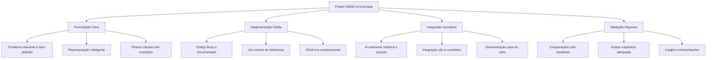

# Aulas 15-16: Período de Desenvolvimento e Entrega do Projeto Final - Aplicando SBSE+IA de Forma Autônoma

## Seção 1: Abertura e Engajamento

### 1.1. Problema Motivador

Imagine que você acabou de ser contratado como Engenheiro de Software Sênior em uma startup inovadora que está revolucionando a interseção entre otimização e inteligência artificial. Seu primeiro projeto é desenvolver uma solução completa que demonstre como SBSE pode potencializar sistemas de IA ou como IA pode revolucionar a engenharia de software tradicional.

Você tem total liberdade criativa e técnica, mas também a responsabilidade de entregar algo que impressione tanto pela inovação quanto pela execução técnica. Não há mais aulas guiadas ou exercícios estruturados – este é o momento de aplicar tudo que você aprendeu de forma completamente autônoma, enfrentando os desafios reais que um profissional da área enfrenta diariamente.

Este período final da disciplina simula fielmente o ambiente de trabalho moderno: você tem uma especificação clara do que deve ser entregue, prazo definido, ferramentas à disposição, e suporte disponível quando necessário, mas a execução depende inteiramente de sua capacidade de gerenciar o projeto, tomar decisões técnicas e resolver problemas de forma independente.

Mais do que uma avaliação, este é o momento em que você se torna um praticante autônomo de SBSE na era da IA.

### 1.2. Objetivos deste Período Final

Ao final deste período de desenvolvimento, você será capaz de:

*   **Executar um Projeto Completo de SBSE+IA:** Demonstrar maestria técnica desde a formulação do problema até a implementação, validação e comunicação dos resultados.
*   **Trabalhar de Forma Autônoma:** Gerenciar seu tempo, tomar decisões técnicas independentes e resolver problemas complexos sem supervisão constante.
*   **Comunicar Resultados Profissionalmente:** Criar documentação técnica de qualidade industrial e apresentar resultados de forma clara e convincente.

## Seção 2: Fundamentos Teóricos (Versão Expressa)

Este período não introduz novos conceitos teóricos, mas sim consolida e aplica todo o conhecimento adquirido ao longo da disciplina. É importante revisar os pilares fundamentais que devem estar presentes em um projeto exemplar de SBSE+IA.

### O Framework Integrado SBSE+IA

Um projeto final de qualidade deve demonstrar domínio dos quatro pilares fundamentais:

1.  **Formulação Sólida do Problema:**
    *   **Problema de Base:** Um desafio real da engenharia de software ou IA que justifique a aplicação de otimização.
    *   **Representação Adequada:** Codificação inteligente das soluções candidatas que capture a essência do problema.
    *   **Função de Fitness Robusta:** Métrica que realmente mede o que você quer otimizar, lidando com trade-offs e restrições.

2.  **Implementação Técnica Competente:**
    *   **Ferramentas Profissionais:** Uso adequado de DEAP, Pymoo, ou outras bibliotecas de otimização.
    *   **Código de Qualidade:** Seguir boas práticas de engenharia de software (PEP 8, type hints, documentação).
    *   **Eficiência Computacional:** Soluções que são práticas e escaláveis.

3.  **Integração Inovadora com IA:**
    *   **IA como Assistente:** LLMs auxiliando na formulação ou na geração de heurísticas.
    *   **IA como Objeto:** Otimização de modelos de ML, prompts ou sistemas de IA.
    *   **IA como Oráculo:** Sistemas de IA avaliando a qualidade de soluções de engenharia de software.

4.  **Validação e Análise Rigorosa:**
    *   **Metodologia Experimental:** Comparações justas com baselines adequados.
    *   **Análise Estatística:** Testes de significância, análise de convergência, métricas de qualidade.
    *   **Interpretação de Resultados:** Insights claros sobre quando e por que a solução funciona.

### Critérios de Excelência



## Seção 3: Exemplo Ilustrativo

Para demonstrar o que constitui um projeto final exemplar, vamos analisar um exemplo hipotético que ilustra todos os elementos esperados.

### Projeto Exemplo: "Otimizador Inteligente de Arquiteturas de Microsserviços com Feedback de LLM"

**Problema de Base:** Decidir como decompor um sistema monolítico em microsserviços é um problema complexo que envolve trade-offs entre performance, manutenibilidade, complexidade operacional e custos de comunicação.

**Formulação SBSE:**
- **Representação:** Cada indivíduo é uma matriz de adjacência que representa quais componentes do sistema pertencem ao mesmo microsserviço.
- **Função de Fitness Multi-Objetivo:** 
  - Minimizar acoplamento entre serviços
  - Maximizar coesão dentro de cada serviço
  - Minimizar complexidade operacional (número de serviços)
  - Maximizar facilidade de manutenção (avaliada por LLM)

**Integração com IA:** Um LLM atua como consultor de arquitetura, avaliando cada solução candidata e fornecendo feedback sobre manutenibilidade, seguindo o prompt:

```python
prompt_arquiteto = """
Você é um arquiteto de software sênior. Analise a seguinte decomposição 
em microsserviços e avalie de 0 a 100 quão manutenível seria esta arquitetura, 
considerando:
- Clareza de responsabilidades
- Facilidade de evolução independente
- Complexidade de debugging
- Overhead operacional

Arquitetura proposta: {decomposicao}
Score (0-100): 
"""
```

**Validação:** Comparar com:
- Decomposição manual feita por arquitetos
- Heurísticas simples (agrupamento por funcionalidade)
- Métodos baseados apenas em análise estática de código

**Resultados Esperados:** 
- Demonstração de que otimização guiada por LLM produz arquiteturas mais manuteníveis
- Análise da Fronteira de Pareto entre diferentes objetivos
- Insights sobre quais características de código levam a melhores decomposições

Este exemplo mostra como integrar todos os elementos: um problema real, formulação técnica sólida, uso inovador de IA, e validação rigorosa.

## Seção 4: Análise e Tópicos Avançados

### Gestão de Projeto Autônomo

O período de desenvolvimento autônomo traz desafios únicos que vão além da implementação técnica:

#### 1. **Gerenciamento de Tempo e Escopo**
- **Decomposição de Tarefas:** Quebrar o projeto em marcos semanais mensuráveis
- **Priorização:** Focar primeiro nos elementos que comprovam a viabilidade técnica
- **Scope Creep:** Resistir à tentação de adicionar funcionalidades que não agregam valor ao objetivo principal
- **Plano B:** Ter uma versão simplificada como fallback se o escopo original for muito ambicioso

#### 2. **Qualidade de Código e Documentação**
- **Padrões Profissionais:** O código deve estar pronto para revisão por outros desenvolvedores
- **Reprodutibilidade:** Qualquer pessoa deve conseguir executar seu notebook e obter os mesmos resultados
- **Documentação como Storytelling:** O notebook deve contar uma história clara da formulação à conclusão

#### 3. **Validação e Experimentação Rigorosa**
- **Metodologia Científica:** Hipóteses claras, experimentos controlados, análise estatística
- **Honestidade Intelectual:** Reportar limitações, falhas e resultados negativos
- **Reprodutibilidade:** Seeds fixas, versionamento de dependências, dados disponíveis

### Armadilhas Comuns e Como Evitá-las

#### Armadilha 1: "Projeto Muito Ambicioso"
*   **Sintoma:** Tentar resolver múltiplos problemas complexos simultaneamente
*   **Mitigação:** Escolha UM problema específico e resolva-o muito bem
*   **Exemplo Ruim:** "Sistema que otimiza arquitetura, testa fairness e gera prompts"
*   **Exemplo Bom:** "Otimizador de configuração de CI/CD com feedback de LLM"

#### Armadilha 2: "IA Cosmética"
*   **Sintoma:** Adicionar LLM apenas para cumprir o requisito, sem valor real
*   **Mitigação:** A IA deve ser fundamental para a solução, não opcional
*   **Teste:** Se você remover a IA, a solução fica significativamente pior?

#### Armadilha 3: "Implementação Sem Validação"
*   **Sintoma:** Focar apenas em fazer o código funcionar, sem provar que funciona bem
*   **Mitigação:** Reserve pelo menos 30% do tempo para experimentação e análise
*   **Evidência de Qualidade:** Comparações quantitativas com pelo menos duas baselines

#### Armadilha 4: "Documentação de Última Hora"
*   **Sintoma:** Deixar toda a documentação para o final
*   **Mitigação:** Documente while you code, tratando o notebook como um artigo científico em desenvolvimento

### Critérios de Avaliação Detalhados

O projeto será avaliado nas seguintes dimensões:

| Critério | Peso | O que será avaliado |
|----------|------|-------------------|
| **Formulação do Problema** | 20% | Originalidade, relevância, complexidade adequada, clareza da especificação |
| **Implementação Técnica** | 25% | Correção, qualidade do código, uso adequado de bibliotecas, eficiência |
| **Integração SBSE+IA** | 20% | Sinergia real (não cosmética), inovação na integração, valor agregado |
| **Validação Experimental** | 15% | Metodologia rigorosa, comparações justas, análise estatística |
| **Documentação** | 10% | Clareza, reprodutibilidade, organização, storytelling |
| **Apresentação em Vídeo** | 10% | Comunicação clara, demonstração prática, insights e conclusões |

### Estratégias de Sucesso

#### Semana 1: Prototipação Rápida
- Implemente uma versão "mínima viável" que demonstra a viabilidade técnica
- Foque em provar que a integração SBSE+IA funciona, mesmo que de forma simplificada
- Objetivo: ter algo funcionando que possa ser refinado

#### Semana 2: Refinamento e Validação
- Melhore a implementação com base nos aprendizados da primeira semana
- Implemente experimentos comparativos e colete dados de performance
- Comece a documentar os experimentos e resultados

### Recursos de Apoio Disponíveis

#### Suporte Técnico Assíncrono
- **Canal:** Email com prefixo `[SBSE-Projeto]` no assunto
- **Resposta:** Até 24 horas em dias úteis
- **Tipo de Dúvidas:** Técnicas, conceituais, de escopo, de interpretação de resultados

#### Ferramentas Recomendadas
- **NotebookLM:** Para pesquisa bibliográfica e geração de roteiros
- **GitHub Copilot:** Para assistência na implementação
- **Weights & Biases:** Para tracking de experimentos (opcional)
- **Google Colab Pro:** Para recursos computacionais adicionais se necessário

#### Bibliografia de Apoio
- Artigos científicos recentes em SBSE disponibilizados durante o curso
- Documentação oficial das bibliotecas (DEAP, Pymoo, OpenAI API)
- Tutoriais e examples nos repositórios oficiais das ferramentas

## Seção 5: Síntese e Próximos Passos

### 5.1. Resumo do Período Final

*   **Autonomia Profissional:** Este período simula a realidade do trabalho em engenharia de software, onde você deve gerenciar projetos complexos de forma independente.
*   **Integração de Conhecimentos:** O projeto final é a síntese de todos os módulos da disciplina, demonstrando domínio tanto de SBSE quanto de técnicas modernas de IA.
*   **Qualidade Industrial:** O nível de qualidade esperado é equivalente ao que seria exigido em um ambiente profissional de desenvolvimento de software.
*   **Comunicação Técnica:** A capacidade de documentar e apresentar resultados técnicos complexos é tão importante quanto a implementação.
*   **Preparação para Carreira:** Este projeto será uma peça fundamental do seu portfólio profissional na interseção entre otimização e IA.

### 5.2. Cronograma Sugerido e Checklist de Entrega

**Cronograma de Desenvolvimento (8 horas distribuídas em 2 semanas):**

**Semana 1 (4 horas):**
- [ ] **Horas 1-2:** Setup do ambiente, revisão do plano e início da implementação básica
- [ ] **Horas 3-4:** Desenvolvimento do núcleo da solução (representação, fitness, algoritmo básico)
- [ ] **Marco da Semana:** Versão mínima funcionando que demonstra a viabilidade

**Semana 2 (4 horas):**
- [ ] **Horas 1-2:** Refinamento da implementação e desenvolvimento dos experimentos
- [ ] **Horas 3-4:** Execução de experimentos, análise de resultados e finalização da documentação

**Checklist de Entrega Final:**

**Artefatos Obrigatórios:**
- [ ] **Jupyter Notebook completo** (`.ipynb`) com todas as células executadas
- [ ] **Vídeo de apresentação** (máximo 15 minutos) em formato MP4
- [ ] **Arquivo README** com instruções de execução e dependências
- [ ] **Dados e modelos** necessários para reprodução (se aplicável)

**Critérios de Qualidade:**
- [ ] Código segue PEP 8 e inclui type hints
- [ ] Todas as funções têm docstrings adequadas
- [ ] Notebook executa do início ao fim sem erros
- [ ] Resultados são reprodutíveis (seeds fixas)
- [ ] Comparações incluem pelo menos 2 baselines
- [ ] Análise estatística adequada (testes de significância quando aplicável)
- [ ] Limitações e trabalhos futuros são discutidos
- [ ] Vídeo demonstra o sistema funcionando na prática

**Formato de Entrega:**
- **Email para:** `[jacksonpradolima@gmail.com]`
- **Assunto:** `[SBSE-ProjetoFinal] [SeuNome] - Título do Projeto`
- **Anexos:** Arquivo ZIP contendo todos os artefatos
- **Prazo:** Conforme especificado no cronograma da disciplina

**Avaliação e Feedback:**
- Correção será realizada em até 2 semanas após a entrega
- Feedback detalhado será enviado individualmente
- Nota final será baseada na rubrica detalhada apresentada na Aula 12

Este é o momento de demonstrar que você se tornou um praticante autônomo e competente de SBSE na era da IA. Boa sorte!